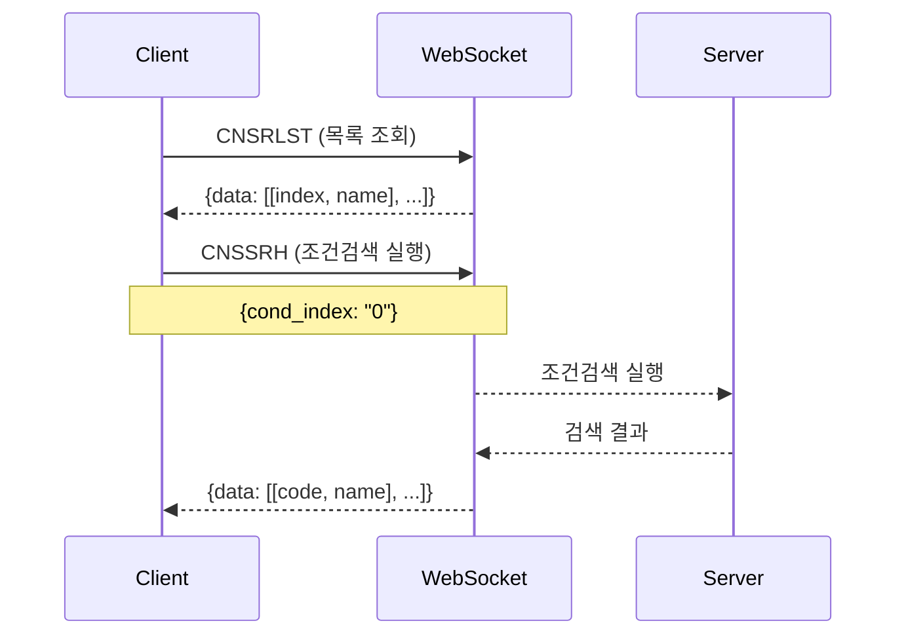

# 조건검색 실행 가이드

**작성일**: 2025-11-08  
**참조**: `docs/조건검색_요청_일반_샘플코드.md`

---

## 📋 개요

키움증권 WebSocket API를 사용한 조건검색 실행 기능

---

## 🔄 조건검색 플로우



---

## 📊 조건검색 실행 (CNSSRH)

### Request

```json
{
    "trnm": "CNSSRH",
    "data": {
        "cond_index": "0"
    }
}
```

### Request 필드

| 필드 | 타입 | 필수 | 설명 |
|------|------|------|------|
| `trnm` | string | ✅ | 트랜잭션 이름 ("CNSSRH") |
| `data` | object | ✅ | 요청 데이터 |
| `data.cond_index` | string | ✅ | 조건검색 인덱스 (CNSRLST에서 조회) |

---

### Response (성공)

```json
{
    "trnm": "CNSSRH",
    "return_code": 0,
    "return_msg": "",
    "data": [
        ["005930", "삼성전자", "78900", "1.52", ...],
        ["000660", "SK하이닉스", "145000", "2.13", ...],
        ["035420", "NAVER", "198000", "-0.50", ...]
    ]
}
```

### Response 필드

| 필드 | 타입 | 설명 |
|------|------|------|
| `trnm` | string | 트랜잭션 이름 ("CNSSRH") |
| `return_code` | int | 응답 코드 (0=성공) |
| `return_msg` | string | 응답 메시지 |
| `data` | array | 검색 결과 종목 목록 |

### data 배열 구조

각 종목은 배열로 표현됩니다:
```python
[
    종목코드,     # 0: "005930"
    종목명,       # 1: "삼성전자"
    현재가,       # 2: "78900"
    등락률,       # 3: "1.52"
    # ... 추가 필드 (API 문서 참조)
]
```

---

## 🔧 구현

### 1. WebSocket 클라이언트에 메서드 추가

```python
async def search_condition(self, condition_index: str) -> Dict[str, Any]:
    """
    조건검색 실행
    
    Args:
        condition_index: 조건검색 인덱스
    
    Returns:
        검색 결과
    """
    # 응답 대기 설정
    response_data = {}
    response_event = asyncio.Event()
    
    async def handle_response(response: Dict[str, Any]):
        nonlocal response_data
        response_data = response
        response_event.set()
    
    # 핸들러 등록
    self.register_handler("CNSSRH", handle_response)
    
    # 요청 전송
    request = {
        "trnm": "CNSSRH",
        "data": {
            "cond_index": condition_index
        }
    }
    await self.send_message(request)
    
    # 응답 대기 (30초 타임아웃)
    await asyncio.wait_for(response_event.wait(), timeout=30.0)
    
    # 응답 검증
    if response_data.get("return_code") != 0:
        raise APIException(f"Search failed: {response_data.get('return_msg')}")
    
    return response_data
```

---

## 🧪 테스트

### 테스트 스크립트: `scripts/test_condition_search.py`

#### 기본 사용법 (자동)

```bash
python scripts/test_condition_search.py
```

**동작**:
1. 조건검색 목록 조회
2. 첫 번째 조건으로 검색 실행
3. 결과 출력 (최대 10개)

---

#### 특정 조건 실행

```bash
python scripts/test_condition_search.py --index 0
```

**동작**:
- 지정한 인덱스의 조건검색 실행
- 결과 출력 (최대 20개)

---

## 📊 예상 출력

### 성공 시

```
============================================================
  조건검색 실행 테스트
============================================================

[STEP 1] 토큰 확인 및 발급...
[INFO] 기존 토큰 사용 (유효함)
  - 만료 시간: 2025-11-09 23:45:12
  - 남은 시간: 85200초

[STEP 2] WebSocket 연결...
[SUCCESS] WebSocket 연결 성공

[STEP 3] 조건검색 목록 조회...
[SUCCESS] 3개의 조건검색 발견

[조건검색 목록]
  1. [0] 상승추세
  2. [1] 거래량급증
  3. [2] 신고가돌파

[STEP 4] 조건검색 실행: [0] 상승추세
[SUCCESS] 조건검색 실행 성공!

[검색 결과]
  return_code: 0
  return_msg: 

[종목 수]: 42개

[종목 목록] (최대 10개)
  1. [005930] 삼성전자
  2. [000660] SK하이닉스
  3. [035420] NAVER
  4. [051910] LG화학
  5. [006400] 삼성SDI
  6. [035720] 카카오
  7. [207940] 삼성바이오로직스
  8. [068270] 셀트리온
  9. [005380] 현대차
  10. [000270] 기아
  ... 외 32개
```

---

### 실패 시 (조건 없음)

```
[STEP 3] 조건검색 목록 조회...
[WARNING] 등록된 조건검색이 없습니다.
  키움 HTS에서 조건검색을 먼저 등록해주세요.
```

**해결**: 키움 HTS에서 조건검색 등록

---

### 실패 시 (타임아웃)

```
[STEP 4] 조건검색 실행: [0] 상승추세
[ERROR] 테스트 실패: Condition search request timeout
```

**원인**:
- 서버 응답 지연
- 조건검색 처리 시간 초과

**해결**: 재시도 또는 타임아웃 증가

---

## 🎯 사용 예시

### Python 코드

```python
from app.client.websocket_client import KiwoomWebSocketClient

async def main():
    # WebSocket 클라이언트 생성
    ws_client = KiwoomWebSocketClient()
    
    # 백그라운드 실행
    asyncio.create_task(ws_client.run())
    await asyncio.sleep(2)
    
    # 1. 조건검색 목록 조회
    condition_list = await ws_client.get_condition_list()
    
    for cond_index, cond_name in condition_list['data']:
        print(f"[{cond_index}] {cond_name}")
    
    # 2. 첫 번째 조건으로 검색
    first_index = condition_list['data'][0][0]
    result = await ws_client.search_condition(first_index)
    
    # 3. 결과 처리
    for stock in result['data']:
        code, name = stock[0], stock[1]
        print(f"{code}: {name}")
```

---

## ⚠️ 주의사항

### 1. 조건검색 등록 필수

키움 HTS에서 조건검색을 먼저 등록해야 합니다:
1. 영웅문 HTS 실행
2. 조건검색 → 조건 관리
3. 조건식 작성 및 저장

### 2. 타임아웃 설정

조건검색은 처리 시간이 걸릴 수 있으므로 타임아웃을 30초로 설정했습니다.

### 3. 인덱스 관리

- 조건검색 인덱스는 문자열 ("0", "1", ...)
- CNSRLST 응답에서 가져온 인덱스 사용
- 직접 하드코딩하지 말 것

### 4. 결과 데이터 구조

응답의 `data` 배열 구조는 API 문서를 참조하세요:
```python
stock = result['data'][0]
code = stock[0]   # 종목코드
name = stock[1]   # 종목명
price = stock[2]  # 현재가 (문자열)
# ... 추가 필드
```

---

## 🔄 전체 워크플로우

### 1단계: 조건검색 목록 조회

```python
condition_list = await ws_client.get_condition_list()
# {
#   'data': [
#     ['0', '상승추세'],
#     ['1', '거래량급증']
#   ]
# }
```

### 2단계: 조건 선택 및 검색 실행

```python
cond_index = "0"  # 첫 번째 조건
result = await ws_client.search_condition(cond_index)
# {
#   'data': [
#     ['005930', '삼성전자', ...],
#     ['000660', 'SK하이닉스', ...]
#   ]
# }
```

### 3단계: 결과 처리

```python
for stock in result['data']:
    code, name = stock[0], stock[1]
    # 종목 정보 저장 또는 알림
```

---

## 📈 활용 예시

### 1. 정기 모니터링

```python
# 30초마다 조건검색 실행
while True:
    result = await ws_client.search_condition("0")
    stocks = result['data']
    
    if len(stocks) > 0:
        print(f"조건 만족 종목: {len(stocks)}개")
        # 알림 전송
    
    await asyncio.sleep(30)
```

### 2. 신규 진입 감지

```python
previous_stocks = set()

while True:
    result = await ws_client.search_condition("0")
    current_stocks = {stock[0] for stock in result['data']}
    
    # 신규 진입 종목
    new_stocks = current_stocks - previous_stocks
    
    if new_stocks:
        print(f"신규 진입: {new_stocks}")
        # 알림 전송
    
    previous_stocks = current_stocks
    await asyncio.sleep(30)
```

### 3. 여러 조건 동시 모니터링

```python
conditions = ["0", "1", "2"]  # 여러 조건

for cond_index in conditions:
    result = await ws_client.search_condition(cond_index)
    print(f"조건 {cond_index}: {len(result['data'])}개 종목")
```

---

## 🎓 다음 단계

1. ✅ 조건검색 목록 조회 (CNSRLST)
2. ✅ 조건검색 실행 (CNSSRH)
3. ⏳ 실시간 조건검색 알림 (CNSSRALM)
4. ⏳ 스케줄러 통합
5. ⏳ FastAPI 엔드포인트 추가

---

**조건검색 실행 기능 구현 완료!** 🎉
