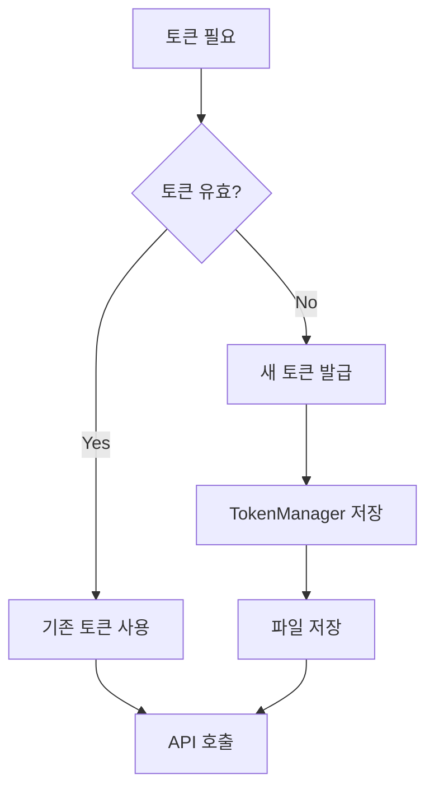

# 토큰 재사용 패턴 가이드

**작성일**: 2025-11-08

---

## 📋 개요

키움증권 API 토큰은 24시간 유효하므로, 불필요한 재발급을 방지하고 기존 토큰을 재사용하는 것이 효율적입니다.

---

## ✅ 권장 패턴

### 1. Token Manager 먼저 확인

```python
from app.core.security import token_manager
from app.client.rest_client import KiwoomRestClient

# ✅ 좋은 패턴
if token_manager.is_token_valid():
    print("기존 토큰 사용")
    token = token_manager.get_token()
else:
    print("새 토큰 발급")
    rest_client = KiwoomRestClient()
    async with rest_client:
        token = await rest_client.get_access_token()
```

### 2. 직접 발급 (비효율적)

```python
# ❌ 비효율적인 패턴
rest_client = KiwoomRestClient()
async with rest_client:
    token = await rest_client.get_access_token()  # 매번 발급
```

---

## 🔍 이유

### 1. Rate Limit 절약
- 키움증권 API는 호출 횟수 제한이 있음
- 불필요한 토큰 발급 요청 감소

### 2. 성능 향상
- 토큰 발급: ~1-2초 소요
- 토큰 조회: 즉시 (메모리/파일)

### 3. 서버 부하 감소
- 매번 발급하면 서버 부하 증가
- 기존 토큰 재사용으로 부하 감소

---

## 📊 비교

| 항목 | 매번 발급 | 재사용 패턴 |
|------|----------|-----------|
| **속도** | 1-2초 | 즉시 |
| **API 호출** | 매번 | 24시간마다 |
| **Rate Limit** | 빠르게 소진 | 절약 |
| **코드 복잡도** | 단순 | 약간 증가 |
| **권장도** | ❌ | ✅ |

---

## 🎯 구현 예시

### 테스트 스크립트

```python
async def test_websocket():
    # 1. 토큰 확인
    if token_manager.is_token_valid():
        print("✅ 기존 토큰 사용")
        info = token_manager.get_token_info()
        print(f"  만료: {info['expires_at']}")
        print(f"  남은시간: {info['remaining_seconds']}초")
    else:
        print("⚠️ 새 토큰 발급")
        await rest_client.get_access_token()
    
    # 2. WebSocket 사용
    ws_client = KiwoomWebSocketClient()
    await ws_client.connect()
```

### API 엔드포인트

```python
from fastapi import APIRouter, Depends
from app.core.security import token_manager
from app.client.rest_client import KiwoomRestClient

router = APIRouter()

@router.get("/conditions")
async def get_conditions():
    # 토큰 확인 및 자동 발급
    if not token_manager.is_token_valid():
        rest_client = KiwoomRestClient()
        async with rest_client:
            await rest_client.get_access_token()
    
    # WebSocket으로 조건 조회
    ws_client = KiwoomWebSocketClient()
    response = await ws_client.get_condition_list()
    
    return response
```

### 헬퍼 함수

```python
async def ensure_token_valid() -> str:
    """
    유효한 토큰 보장 (없으면 발급)
    
    Returns:
        access_token
    """
    if token_manager.is_token_valid():
        return token_manager.get_token()
    
    # 토큰 발급
    rest_client = KiwoomRestClient()
    async with rest_client:
        return await rest_client.get_access_token()

# 사용
token = await ensure_token_valid()
```

---

## 🔄 토큰 라이프사이클



---

## 📝 Token Manager API

### 주요 메서드

```python
# 토큰 유효성 확인
is_valid = token_manager.is_token_valid()
# Returns: bool (만료 5분 전까지 True)

# 토큰 조회
token = token_manager.get_token()
# Returns: str | None

# 토큰 정보 조회
info = token_manager.get_token_info()
# Returns: {
#     'has_token': bool,
#     'is_valid': bool,
#     'expires_at': str,
#     'remaining_seconds': int,
#     'token_preview': str
# }

# 토큰 저장
token_manager.set_token(access_token, expires_in)

# 토큰 삭제
token_manager.clear_token()
```

---

## ⚠️ 주의사항

### 1. 만료 5분 전 갱신
TokenManager는 만료 5분 전부터 `is_token_valid()`가 `False`를 반환합니다.

```python
# 토큰 만료: 2025-11-09 10:00:00
# 2025-11-09 09:54:59 → is_valid = True
# 2025-11-09 09:55:00 → is_valid = False (갱신 필요)
```

### 2. 멀티 프로세스
여러 프로세스가 동시에 실행되면 파일 기반 토큰 공유가 작동합니다.

```bash
# 프로세스 A: API 서버
uvicorn app.main:app

# 프로세스 B: 스케줄러
python scripts/start_scheduler.py

# 둘 다 data/.token 파일 공유
```

### 3. 파일 저장
토큰은 `data/.token` 파일에 자동 저장되므로 서버 재시작 시에도 유지됩니다.

---

## 🎉 베스트 프랙티스

### 1. 항상 확인 먼저
```python
# ✅ 권장
if not token_manager.is_token_valid():
    await get_new_token()
```

### 2. 헬퍼 함수 사용
```python
# ✅ 권장
token = await ensure_token_valid()
```

### 3. 자동 갱신 스케줄러
```python
# 매일 오전 8시에 토큰 갱신
@scheduler.scheduled_job('cron', hour=8)
async def refresh_token():
    await rest_client.get_access_token()
```

---

## 📊 성능 비교

### 시나리오: 10번의 API 호출

| 방식 | 토큰 발급 횟수 | 소요 시간 |
|------|---------------|----------|
| **매번 발급** | 10회 | ~10-20초 |
| **재사용** | 1회 | ~1-2초 |

**결론**: 재사용 패턴이 약 **5-10배 빠름** ⚡

---

## 🔗 관련 코드

- `app/core/security.py` - TokenManager 구현
- `app/client/rest_client.py` - 토큰 발급
- `scripts/test_websocket.py` - 재사용 패턴 예시

---

**요약**: 토큰은 24시간 유효하므로 `token_manager`에서 먼저 확인하고, 유효하지 않을 때만 발급하세요! 🚀
