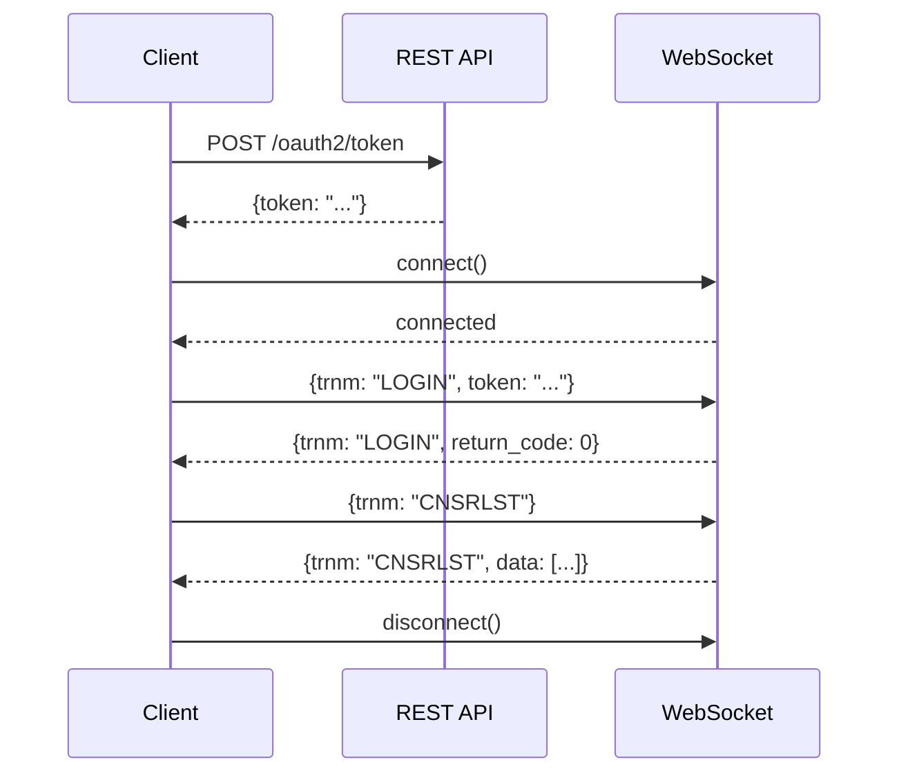

# WebSocket 조건검색 목록조회 개발 문서

**작성일**: 2025-11-08  
**참조**: `docs/조건검색_목록조회_샘플코드.md`

---

## 📋 개요

키움증권 WebSocket API를 사용한 조건검색 목록조회 기능 구현

---

## 🔗 WebSocket 연결 정보

### URL

```python
# 실전투자
wss://api.kiwoom.com:10000/api/dostk/websocket

# 모의투자
wss://mockapi.kiwoom.com:10000/api/dostk/websocket
```

### 프로토콜
- **Transport**: WebSocket (wss://)
- **Port**: 10000
- **Format**: JSON

---

## 🔑 인증 (LOGIN)

### 연결 시 자동 로그인

WebSocket 연결 직후 로그인 패킷을 전송해야 합니다.

#### Request
```json
{
    "trnm": "LOGIN",
    "token": "ACCESS_TOKEN"
}
```

#### Response (성공)
```json
{
    "trnm": "LOGIN",
    "return_code": 0,
    "return_msg": "로그인 성공"
}
```

#### Response (실패)
```json
{
    "trnm": "LOGIN",
    "return_code": 1,
    "return_msg": "로그인 실패 메시지"
}
```

---

## 📊 조건검색 목록조회 (CNSRLST)

### Request
```json
{
    "trnm": "CNSRLST"
}
```

### Response
```json
{
    "trnm": "CNSRLST",
    "return_code": 0,
    "return_msg": "",
    "data": [
        ["0", "조건1"],
        ["1", "조건2"],
        ["2", "조건3"],
        ["3", "조건4"],
        ["4", "조건5"]
    ]
}
```

### 응답 필드
| 필드 | 타입 | 설명 |
|------|------|------|
| `trnm` | string | 트랜잭션 이름 ("CNSRLST") |
| `return_code` | int | 응답 코드 (0=성공) |
| `return_msg` | string | 응답 메시지 |
| `data` | array | 조건검색 목록 [[ID, 이름], ...] |

---

## 🔄 PING-PONG

서버가 주기적으로 PING을 보내면 그대로 에코백해야 합니다.

### Server -> Client
```json
{
    "trnm": "PING",
    ...
}
```

### Client -> Server
```json
{
    "trnm": "PING",
    ...
}
```
(수신한 메시지를 그대로 송신)

---

## 🏗️ 구현 구조

### 1. WebSocket 클라이언트 (`app/client/websocket_client.py`)

```python
class KiwoomWebSocketClient:
    """키움증권 WebSocket 클라이언트"""
    
    async def connect() -> bool:
        """연결 및 자동 로그인"""
    
    async def send_message(message: Dict) -> None:
        """메시지 전송"""
    
    async def receive_messages() -> None:
        """메시지 수신 루프"""
    
    async def disconnect() -> None:
        """연결 종료"""
    
    def register_handler(trnm: str, handler: Callable) -> None:
        """메시지 핸들러 등록"""
    
    async def get_condition_list() -> Dict:
        """조건검색 목록 조회"""
```

### 2. 핵심 기능

#### 자동 로그인
```python
async def connect(self):
    self.websocket = await websockets.connect(self.uri)
    
    # 토큰 가져오기
    access_token = token_manager.get_token()
    
    # 로그인 패킷 전송
    await self.send_message({
        "trnm": "LOGIN",
        "token": access_token
    })
```

#### 메시지 핸들러 시스템
```python
# 핸들러 등록
def register_handler(self, trnm: str, handler: Callable):
    self._message_handlers[trnm] = handler

# 메시지 수신 시 핸들러 호출
async def receive_messages(self):
    response = json.loads(await self.websocket.recv())
    trnm = response.get("trnm")
    
    if trnm in self._message_handlers:
        await self._message_handlers[trnm](response)
```

#### 조건검색 목록 조회
```python
async def get_condition_list(self) -> Dict:
    # 응답 대기용 이벤트
    response_event = asyncio.Event()
    response_data = {}
    
    # 핸들러 등록
    async def handle_response(response):
        nonlocal response_data
        response_data = response
        response_event.set()
    
    self.register_handler("CNSRLST", handle_response)
    
    # 요청 전송
    await self.send_message({"trnm": "CNSRLST"})
    
    # 응답 대기 (타임아웃 10초)
    await asyncio.wait_for(response_event.wait(), timeout=10.0)
    
    return response_data
```

---

## 🧪 테스트

### 테스트 스크립트 (`scripts/test_websocket.py`)

```bash
# 전체 테스트
python scripts/test_websocket.py --mode all

# 로그인만 테스트
python scripts/test_websocket.py --mode login

# 조건검색 목록조회만 테스트
python scripts/test_websocket.py --mode list
```

### 테스트 시나리오

1. **WebSocket 로그인 테스트**
   - REST API로 토큰 발급
   - WebSocket 연결
   - 자동 로그인
   - 응답 확인

2. **조건검색 목록조회 테스트**
   - 토큰 발급
   - WebSocket 연결
   - CNSRLST 요청
   - 응답 파싱
   - 목록 출력

---

## 📦 의존성

### 추가된 패키지

```toml
dependencies = [
    ...
    "websockets>=12.0",
]
```

### 설치

```bash
# UV 사용
uv pip install websockets

# 또는 pip
pip install websockets>=12.0
```

---

## 🔧 사용 예시

### 기본 사용법

```python
from app.client.websocket_client import KiwoomWebSocketClient
from app.client.rest_client import KiwoomRestClient

async def main():
    # 1. 토큰 발급
    rest_client = KiwoomRestClient()
    async with rest_client:
        await rest_client.get_access_token()
    
    # 2. WebSocket 클라이언트 생성
    ws_client = KiwoomWebSocketClient()
    
    # 3. 백그라운드에서 메시지 수신 시작
    receive_task = asyncio.create_task(ws_client.run())
    
    # 4. 연결 대기
    await asyncio.sleep(2)
    
    # 5. 조건검색 목록 조회
    response = await ws_client.get_condition_list()
    
    # 6. 결과 출력
    for cond_id, cond_name in response['data']:
        print(f"[{cond_id}] {cond_name}")
    
    # 7. 연결 종료
    await ws_client.disconnect()
```

### 싱글톤 패턴 사용

```python
from app.client.websocket_client import get_websocket_client

async def main():
    ws_client = get_websocket_client()
    
    # 백그라운드 실행
    asyncio.create_task(ws_client.run())
    await asyncio.sleep(2)
    
    # 조건검색 목록 조회
    response = await ws_client.get_condition_list()
```

---

## ⚠️ 주의사항

### 1. 토큰 필수
WebSocket 로그인 전에 REST API로 토큰을 먼저 발급받아야 합니다.

### 2. 연결 상태 확인
메시지 전송 전에 `ws_client.connected` 상태를 확인하세요.

### 3. PING-PONG 처리
서버의 PING 메시지를 반드시 에코백해야 연결이 유지됩니다.

### 4. 타임아웃 설정
`get_condition_list()`는 10초 타임아웃이 설정되어 있습니다.

### 5. 에러 처리
```python
try:
    response = await ws_client.get_condition_list()
except asyncio.TimeoutError:
    print("응답 타임아웃")
except APIException as e:
    print(f"API 에러: {e}")
```

---

## 🔄 통합 플로우

### 전체 프로세스



---

## 📊 응답 예시

### 성공 응답
```json
{
    "trnm": "CNSRLST",
    "return_code": 0,
    "return_msg": "",
    "data": [
        ["0", "상승추세"],
        ["1", "거래량급증"],
        ["2", "신고가돌파"],
        ["3", "골든크로스"],
        ["4", "급등주"]
    ]
}
```

### 실패 응답
```json
{
    "trnm": "CNSRLST",
    "return_code": 1,
    "return_msg": "조건검색 조회 실패"
}
```

### 빈 목록
```json
{
    "trnm": "CNSRLST",
    "return_code": 0,
    "return_msg": "",
    "data": []
}
```

---

## 🎯 다음 단계

1. ✅ WebSocket 클라이언트 구현
2. ✅ 조건검색 목록조회 구현
3. ✅ 테스트 스크립트 작성
4. ⏳ 조건검색 실행 기능 (CNSSRH)
5. ⏳ 실시간 조건검색 알림 (CNSSRALM)

---

**완료**: 조건검색 목록조회 기능 구현 완료! 🎉
